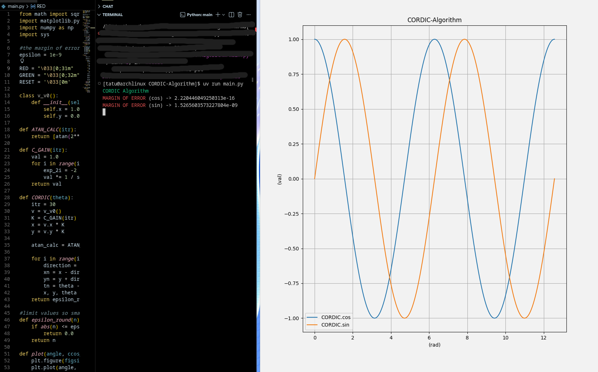

### CORDIC Algorithm
> CORDIC algorithm that calculates sin & cos using vector rotations and fast iterations. Taught me a bit about reading math papers and implementing with an engineering mindset. The CORDIC algorithm deepened my understanding for this branch of mathematics to a certain level. 

- Requirements : Matplotlib & Numpy
