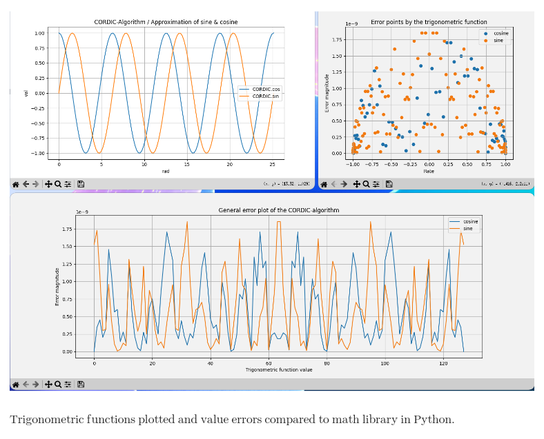

### CORDIC Algorithm
> An implementation of the CORDIC algorithm for calculating sine and cosine using iterative vector rotations. This project gave me a better understanding of how mathematical algorithms can be translated into working code, as well as some experience reading and implementing ideas from technical papers.

- Requirements : Matplotlib & Numpy
